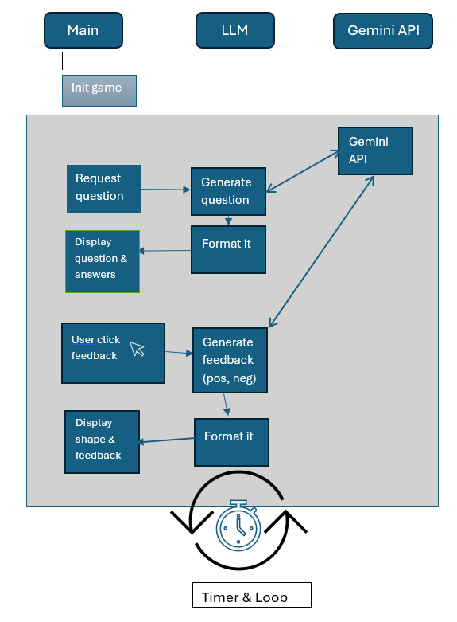

# Trivia Game

This is a simple trivia game designed for kids aged 10 and above. The game uses a graphical interface powered by Python's `turtle` module and integrates with the Gemini API to provide dynamic feedback and trivia questions.

## Features

- **Dynamic Trivia Questions**: Generates multiple-choice trivia questions using the Gemini API.
- **Interactive Feedback**: Displays a heart for correct answers and a sad face for incorrect answers.
- **Score Tracking**: Keeps track of the player's score throughout the game.
- **Kid-Friendly Design**: Simple and engaging interface tailored for children.

## How it works

The game flow is visually represented below:

<!--  -->
<p >
    
</p>
The diagram illustrates how the game interacts with the user and the Gemini API to provide a seamless trivia experience.

## Example of Executing the Game
The question:
<p>
    
</p>
The answer:
<p >
    
</p>

## Prerequisites

- Python 3.10 or higher
- Required Python packages:
  - `google-generativeai`
  - `python-dotenv`
  - `turtle`

## Installation

1. Clone the repository or download the source code.
2. Install the required Python packages:
   ```sh
   pip install google-generativeai python-dotenv
   ```
3. Set up the `.env` file with your Gemini API credentials:
   ```env
   GEMINI_API_KEY="your_api_key_here"
   GEMINI_MODEL="gemini-2.0-flash"
   ```

## How to Run

1. Open a terminal in the project directory.
2. Run the `main.py` file:
   ```sh
   python main.py
   ```

## How to Play

1. A trivia question with four options will appear on the screen.
2. Enter the number corresponding to your answer in the input box.
3. If your answer is correct, a heart will be displayed, and your score will increase.
4. If your answer is incorrect, a sad face will be displayed.
5. The game will automatically proceed to the next question after a short pause.

## File Structure

- `llm.py`: Handles interactions with the Gemini API.
- `shapes.py`: Contains functions to draw graphical elements like hearts and sad faces.
- `main.py`: Main game logic and user interface.
- `.env`: Stores API credentials for the Gemini API.

## License

This project is for educational purposes only and is not intended for commercial use.

## Acknowledgments

- [Google Generative AI](https://developers.generativeai.google/) for providing the Gemini API.
- Python's `turtle` module for the graphical interface.
